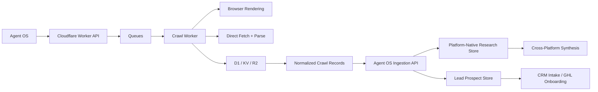

# Cloudflare Crawl Architecture

## Goal
Use Cloudflare as the crawl and scheduling layer for:
- viral content discovery
- public-page enrichment
- lead prospect discovery

Keep Agent OS as the intelligence and memory layer.

## Core Principle
- Cloudflare gathers and normalizes public-web data.
- Agent OS stores, scores, and operationalizes it.
- DeerFlow handles deeper extraction logic, QA, and research synthesis when needed.

This keeps crawling scalable without turning Agent OS into a fragile scraper runtime.

## System Split


## Recommended Cloudflare Products
- `Workers`: public entrypoint and orchestration API
- `Queues`: crawl job fanout, retries, backpressure
- `Browser Rendering`: JS-heavy page rendering
- `D1`: metadata, dedupe, crawl job state
- `KV`: hot caches, URL fingerprints, short-lived state
- `R2`: raw HTML, screenshots, rendered page artifacts
- `Cron Triggers`: recurring niche crawls and refreshes

## Two Crawl Lanes

### 1. Viral Research Lane
Purpose:
- find current high-performing public content
- preserve platform separation
- support later cross-platform synthesis

Inputs:
- niche
- platform list
- creator handles
- keyword sets
- freshness window

Outputs:
- public post/video URLs
- normalized platform-native records
- freshness and engagement signals

### 2. Lead Prospect Lane
Purpose:
- collect public business/prospect information
- enrich prospects before GHL onboarding

Inputs:
- niche
- geography
- website seeds
- public directories
- public social profile URLs

Outputs:
- business name
- website
- public email/phone if visible
- niche
- location
- social handles

Important:
- keep lead prospect data separate from viral research data
- do not mix “what content is winning” with “who should we sell to”

## Worker Endpoints

### `POST /crawl/discovery`
Creates discovery jobs.

Request:
```json
{
  "mode": "viral_research",
  "niche": "wedding photography and videography",
  "platforms": ["tiktok", "youtube", "linkedin", "instagram"],
  "freshOnly": true,
  "maxCandidatesPerPlatform": 20,
  "source": "agent-os"
}
```

Alternative lead mode:
```json
{
  "mode": "lead_prospecting",
  "niche": "dog training",
  "geography": "Orange County, CA",
  "sources": ["google_results", "directories", "public_instagram_profiles"],
  "source": "agent-os"
}
```

Response:
```json
{
  "jobId": "crawl_job_123",
  "accepted": true,
  "queuedCount": 48
}
```

### `POST /crawl/page`
Enqueues a single page crawl directly.

Request:
```json
{
  "mode": "viral_research",
  "platform": "tiktok",
  "url": "https://www.tiktok.com/@example/video/123",
  "source": "agent-os"
}
```

### `GET /crawl/jobs/:jobId`
Returns job state.

Response:
```json
{
  "jobId": "crawl_job_123",
  "status": "running",
  "processed": 12,
  "queued": 48,
  "errors": 1
}
```

### `POST /ingest/normalized`
Worker webhook into Agent OS after normalization.

This should be authenticated with a shared secret.

## Queue Payload Schemas

### Discovery Queue Payload
```json
{
  "jobId": "crawl_job_123",
  "mode": "viral_research",
  "platform": "youtube",
  "niche": "luxury real estate",
  "keyword": "luxury real estate shorts",
  "freshOnly": true,
  "source": "agent-os"
}
```

### Page Crawl Queue Payload
```json
{
  "jobId": "crawl_job_123",
  "mode": "viral_research",
  "platform": "instagram",
  "url": "https://www.instagram.com/reel/abc123/",
  "discoveredFrom": "keyword_search",
  "source": "agent-os"
}
```

## Crawl Decision Rules
- use direct fetch first for simple HTML pages
- escalate to Browser Rendering for:
  - client-side rendered pages
  - social pages with lazy content
  - pages where fetch lacks the visible text/metrics
- store the raw artifact either way

## Raw Storage Model

### D1 tables
- `crawl_jobs`
- `crawl_pages`
- `crawl_errors`
- `crawl_results_index`

### KV keys
- dedupe by URL hash
- recent crawl signatures
- freshness cursor state

### R2 paths
- `raw-html/<jobId>/<hash>.html`
- `rendered-html/<jobId>/<hash>.html`
- `screenshots/<jobId>/<hash>.png`
- `normalized-json/<jobId>/<hash>.json`

## Normalized Record Schemas

### Viral Research Record
```json
{
  "recordType": "viral_research",
  "platform": "tiktok",
  "sourceType": "video",
  "url": "https://www.tiktok.com/@example/video/123",
  "creator": {
    "handle": "@example",
    "displayName": "Example Creator"
  },
  "title": "",
  "caption": "Hook text here",
  "engagement": {
    "views": 1200000,
    "likes": 86000,
    "comments": 4200,
    "shares": 19000
  },
  "freshness": {
    "publishedAtText": "2 days ago",
    "freshOnlyMatch": true
  },
  "topics": ["dog training", "reactive dogs"],
  "hooks": ["Stop leash pulling in 3 steps"],
  "cta": "DM GUIDE",
  "platformMetadata": {},
  "rawArtifactPath": "r2://normalized-json/crawl_job_123/hash.json"
}
```

### Lead Prospect Record
```json
{
  "recordType": "lead_prospect",
  "businessName": "OC Calm Dogs",
  "website": "https://occalmdogs.com",
  "publicEmail": "hello@occalmdogs.com",
  "publicPhone": "+1-555-000-0000",
  "niche": "dog training",
  "geography": "Orange County, CA",
  "socialProfiles": [
    "https://www.instagram.com/occalmdogs"
  ],
  "notes": "Strong local positioning, weak CTA on homepage",
  "rawArtifactPath": "r2://normalized-json/crawl_job_456/hash.json"
}
```

## Agent OS Ingestion Design

### New ingestion route
Recommended:
- `POST /api/cloudflare-ingest`

The route should:
- validate shared secret
- inspect `recordType`
- store viral research separately from lead prospects
- emit system events for observability

### Viral research ingestion
On ingest:
- write into `viral-research.json` or a future structured store
- keep platform-native datasets separate
- do not flatten cross-platform ranking at ingest time
- derive synthesis later

### Lead prospect ingestion
On ingest:
- write to a new `lead-prospects.json`
- optionally create a draft client-intake packet
- never auto-create a GHL client without review

## Derivation Rules

### Platform-native first
For viral research:
- TikTok winners stay in TikTok dataset
- YouTube winners stay in YouTube dataset
- LinkedIn winners stay in LinkedIn dataset
- Instagram winners stay in Instagram dataset

### Cross-platform second
Only after platform packets are built:
- compare repeated topics
- compare hook families
- compare CTA patterns
- compare proof styles

## Where DeerFlow Fits
Use DeerFlow for:
- deep extractor QA
- platform-specific extraction refinement
- anomaly review when parsing is weak
- “why did this page fail to normalize?” investigations
- research synthesis over already-ingested normalized records

Do not use DeerFlow as the first-line crawler.

## Compliance Notes
- respect public/private boundaries
- do not scrape logged-in/private data
- do not bypass access controls
- treat public contact collection carefully
- keep a clear lawful-business-use policy for outreach data

## Implementation Phases

### Phase 1
- Cloudflare discovery worker
- crawl queue
- page crawl worker
- normalized webhook into Agent OS
- viral research lane only

### Phase 2
- lead prospect lane
- separate prospect store
- prospect review UI in Agent OS

### Phase 3
- custom scoring
- freshness heuristics
- screenshot review
- automated crawl schedules by niche

## Concrete Next Build
1. Create `docs` + contract first
2. Add `POST /api/cloudflare-ingest` in Agent OS
3. Add `lead-prospects.json` store
4. Add idempotent ingest logic for `viral_research` and `lead_prospect`
5. Build the first Worker + Queue payload handler outside Agent OS
